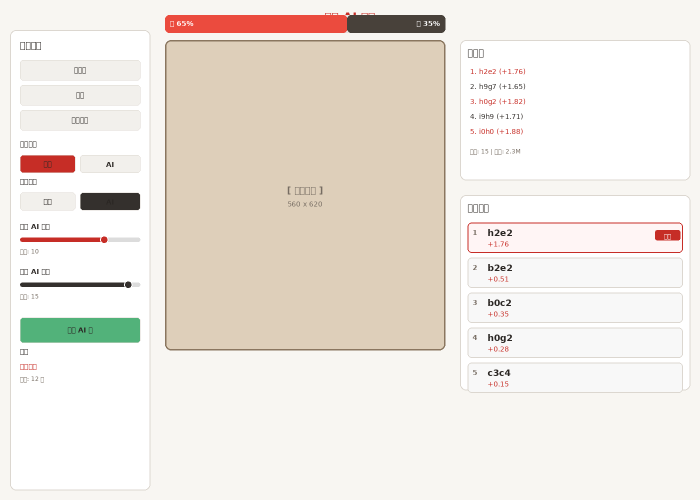

# 象棋 AI 前端 UI 设计

## 预览图


## 布局说明

### 整体布局（1400x1000）
采用三栏布局，适合桌面端和平板横屏使用。

---

## 左侧控制面板（280px 宽）

### 游戏控制区
- **开新局** - 重置棋盘，开始新游戏
- **悔棋** - 撤销上一步（或两步）
- **翻转棋盘** - 旋转视角，方便黑方玩家

### 玩家设置
- **红方玩家** - 选择"人类"或"AI"
- **黑方玩家** - 选择"人类"或"AI"
- 支持：人vs人、人vsAI、AIvsAI

### AI 强度设置
- **红方 AI 强度** - 滑块调节（深度 1-20）
- **黑方 AI 强度** - 滑块调节（深度 1-20）
- 实时显示当前深度值

### AI 控制
- **本步 AI 走** - 强制 AI 立即计算并走棋
- 用于 AI vs AI 对局，或让 AI 帮忙走一步

### 状态显示
- 当前回合（红方/黑方）
- 已走步数
- 游戏状态（进行中/结束）

---

## 中央棋盘区（560x620）

### 胜率条（560x35）
位于棋盘正上方，实时显示：
- **红色部分** - 红方胜率
- **黑色部分** - 黑方胜率
- **百分比显示** - 两端显示具体数值

### 棋盘
- 尺寸：560x620 像素
- 使用生成的高端棋盘和棋子资源
- 支持鼠标点击移动
- 高亮显示：
  - 可走位置
  - 上一步移动
  - 选中的棋子

---

## 右侧分析面板（260px 宽）

### 主变例（280px 高）
显示 AI 计算的最佳着法序列：
- **着法序列** - 1. h2e2 (+1.76)
- **评分显示** - 正数=红方优势，负数=黑方优势
- **颜色标识** - 红方着法用红色，黑方用黑色
- **引擎信息** - 深度、搜索节点数

### 推荐着法（390px 高）
显示 MultiPV 返回的多个推荐选项（前5名）：
- **排名** - 1-5
- **着法** - UCI 坐标格式
- **评分** - 厘兵单位
- **标签** - "最佳"标记第一名
- **可点击** - 点击直接走该步

---

## 技术特性

### 响应式设计
- 桌面端：完整三栏布局
- 平板横屏：保持三栏，略微调整宽度
- 平板竖屏/手机：折叠为单栏，底部按钮控制

### 实时更新
- 胜率条：每步棋后实时更新
- 主变例：AI 计算时实时显示
- 推荐着法：根据 MultiPV 设置显示多个选项

### 交互反馈
- 按钮 hover 效果
- 棋子拖拽动画
- 移动高亮效果
- 非法移动提示

---

## 配色方案

| 元素 | 颜色 | 说明 |
|------|------|------|
| 背景 | #F8F6F2 | 温暖米色 |
| 卡片 | #FFFFFF | 纯白 |
| 主色（红） | #C62D26 | 鲜明红色 |
| 主色（黑） | #342D2D | 深炭灰 |
| 文字深色 | #2A2623 | 深棕色 |
| 文字浅色 | #766C62 | 中灰色 |
| 边框 | #DCD7D0 | 浅灰边框 |
| 按钮 | #F2F0EC | 浅米色 |

---

## 实现建议

### 技术栈
- **前端框架**: React / Vue 3
- **UI 库**: 可选 Ant Design / Element Plus
- **棋盘渲染**: HTML Canvas / SVG
- **引擎通信**: WebSocket / Server-Sent Events
- **状态管理**: Zustand / Pinia

### 核心组件
1. `Board.vue/jsx` - 棋盘组件
2. `WinRateBar.vue/jsx` - 胜率条
3. `ControlPanel.vue/jsx` - 左侧控制面板
4. `AnalysisPanel.vue/jsx` - 右侧分析面板
5. `PieceComponent.vue/jsx` - 棋子组件

### API 设计
```javascript
// 获取 AI 推荐
POST /api/analyze
{
  "position": "rnbakabnr/9/1c5c1/p1p1p1p1p/9/9/P1P1P1P1P/1C5C1/9/RNBAKABNR w - - 0 1",
  "depth": 15,
  "multiPV": 5
}

// 响应
{
  "winRate": 0.65,
  "principalVariation": [...],
  "recommendations": [...]
}
```

---

## 下一步

1. ✅ UI 预览图设计完成
2. ⏳ 前端页面开发
3. ⏳ 引擎接口封装
4. ⏳ 交互逻辑实现
5. ⏳ 响应式适配
