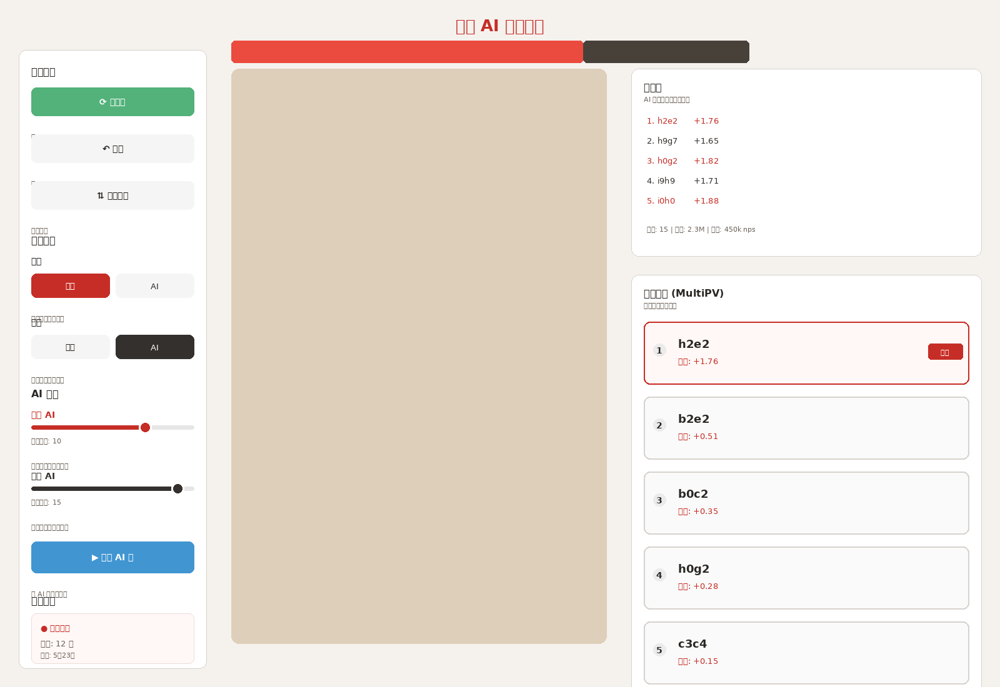

# 象棋 AI 前端界面预览

## 最新预览图（v2）

**尺寸**: 1600 x 1100 像素

---

## 界面说明

### 左侧控制面板

#### 1️⃣ 游戏控制区

**⟳ 开新局**
- 功能：开始新的对局
- 说明：重置棋盘到初始位置

**↶ 悔棋**
- 功能：撤销上一步或两步
- 说明：人机对局撤销2步，人人对局撤销1步

**⇅ 翻转棋盘**
- 功能：旋转视角
- 说明：方便黑方玩家从自己的角度查看

---

#### 2️⃣ 对局设置

**红方**
- 选项：人类 / AI
- 说明：选择红方由谁控制

**黑方**
- 选项：人类 / AI
- 说明：选择黑方由谁控制

支持模式：
- 人 vs 人
- 人 vs AI
- AI vs AI（自动对局）

---

#### 3️⃣ AI 强度设置

**红方 AI 强度**
- 调节方式：滑块
- 范围：深度 1-20
- 说明：深度越高越强但越慢

**黑方 AI 强度**
- 调节方式：滑块
- 范围：深度 1-20
- 说明：深度越高越强但越慢

---

#### 4️⃣ AI 控制

**▶ 本步 AI 走**
- 功能：让 AI 帮忙走一步
- 用途：
  - AI vs AI 对局时推进游戏
  - 人类玩家请求提示
  - 让 AI 代走一步

---

#### 5️⃣ 对局状态

显示信息：
- **当前回合**：红方 / 黑方
- **已走步数**：记录走棋数量
- **用时**：对局总用时

---

### 中央棋盘区

#### 胜率条
位于棋盘正上方，实时显示：
- **红色区域**：红方胜率（例如 68%）
- **黑色区域**：黑方胜率（例如 32%）
- 根据 AI 评分实时计算

#### 棋盘
- 使用真实的高端棋盘资源
- 尺寸：约 828 x 920 像素
- 特性：
  - 点击选择棋子
  - 高亮可移动位置
  - 显示上一步移动

---

### 右侧分析面板

#### 主变例
显示 AI 计算的最佳着法序列：
- **着法列表**：1. h2e2, 2. h9g7, 3. h0g2...
- **评分**：每步后的局势评分
- **颜色标识**：红方着法用红色，黑方用黑色
- **引擎信息**：深度、搜索节点数、速度

#### 推荐着法 (MultiPV)
显示多个推荐选项（前5名）：
- **排名**：1-5，圆圈显示
- **着法**：UCI 坐标格式（例如 h2e2）
- **评分**：厘兵单位，正数=红方优势
- **最佳标签**：第一名显示"最佳"标记
- **交互**：点击着法直接走棋

---

## 配色方案

| 用途 | 颜色值 | 说明 |
|------|--------|------|
| 页面背景 | #F5F2EE | 温暖浅灰 |
| 卡片背景 | #FFFFFF | 纯白 |
| 红方主色 | #C62D26 | 鲜明红色 |
| 黑方主色 | #342D2D | 深炭灰 |
| 深色文字 | #2A2623 | 深棕色 |
| 浅色文字 | #6C625B | 中灰色 |
| 边框 | #D7D2CD | 浅灰边框 |
| 绿色按钮 | #52969E | 青绿色 |
| 蓝色按钮 | #419ED2 | 明亮蓝 |

---

## 功能特性

### 实时更新
- ⚡ 胜率条：每步棋后实时更新
- ⚡ 主变例：AI 计算时实时显示
- ⚡ 推荐着法：MultiPV 返回多个选项

### 交互反馈
- ✨ 按钮 hover 效果
- ✨ 棋子拖拽动画
- ✨ 移动高亮效果
- ✨ 非法移动提示

### 智能提示
- 💡 显示可走位置
- 💡 推荐最佳着法
- 💡 实时胜率分析

---

## 与 v1 的改进

✅ **真实棋盘**：使用实际生成的高端棋盘资源
✅ **详细说明**：每个按钮都有清晰的功能描述
✅ **更好的布局**：改进间距和视觉层次
✅ **现代设计**：更精致的配色和圆角
✅ **图标增强**：按钮带有图标更易识别

---

## 下一步开发

1. ⏳ 前端框架选择（React / Vue 3）
2. ⏳ 棋盘组件开发
3. ⏳ 引擎 WebSocket 接口
4. ⏳ 拖拽交互实现
5. ⏳ 响应式布局适配
